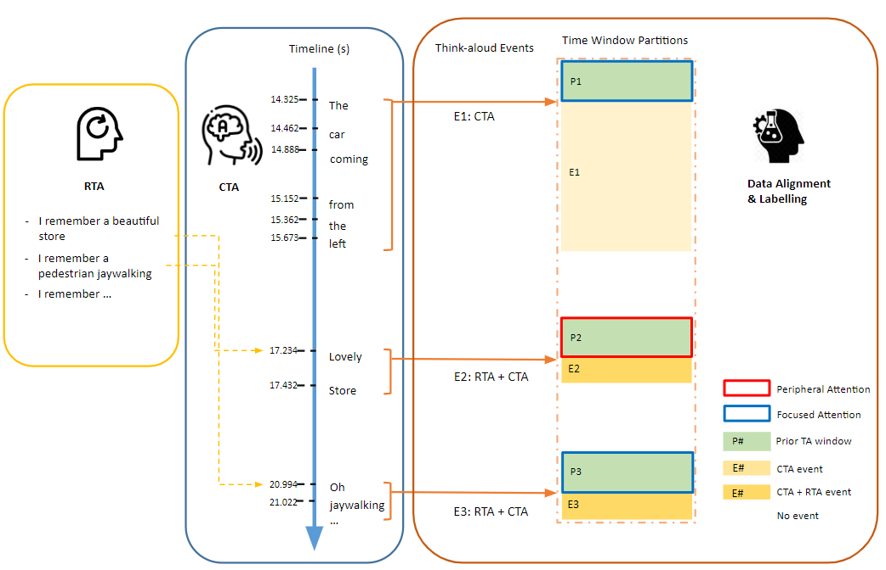

## CHI 2024 paper - Seeing Think-aloud: Tracking Driving Visual Attention with Eye Movements and Verbalization

This repo contains source code of driving related research, supports our manuscript submitted to CHI 2024

### Setups
```
git clone [omitted for blind review]
```

### Contents
This code repo contains the overall ML data pipline introduced in the paper. 




### Contacts
Please contact [omitted for blind review] for questions or raise issue in this repo